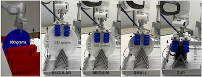

# [ContactInsert](https://sites.google.com/view/compliant-object-insertion)



This repository has the training and deployment code as well as trained models for the paper

["Zero-Shot Transfer of Haptics-based Object Insertion Policies"](http://arxiv.org/abs/2301.12587) - [Samarth Brahmbhatt](https://samarth-robo.github.io), [Ankur Deka](https://ankur-deka.github.io), [Andrew Spielberg](http://www.andrewspielberg.com), and [Matthias Müller](https://matthias.pw), ICRA 2023.

The code is divided into directories.
- Simulation training:
  - [`rl`](rl) (entry point): Simulation environment and training framework, including reproduction of the ICRA 2023 paper.
  - [`robosuite`](robosuite): Fork of [`robosuite`](https://robosuite.ai) which implements policy inference delay randomization.
- Real robot deployment:
  - [`ros_controllers`](ros_controllers) (entry point): ROS package implementing operational space control for the Frank Emika Panda robot.
  - [`ros_drivers_utils`](ros_drivers_utils): [Soft Robotics mGrip](https://www.softroboticsinc.com/products/mgrip-modular-gripping-solution-for-food-automation/) gripper ROS driver, and some other utilities.
  - [`arduino`](arduino): [Soft Robotics mGrip](https://www.softroboticsinc.com/products/mgrip-modular-gripping-solution-for-food-automation/) gripper control circuit and Arduino code.

## Code contributors
- [Samarth Brahmbhatt](https://samarth-robo.github.io)
- [Ankur Deka](https://ankur-deka.github.io)
- [Andrew Spielberg](http://www.andrewspielberg.com)

## Citation
```
@InProceedings{Brahmbhatt_2023_ICRA,
author = {Brahmbhatt, Samarth and Deka, Ankur and Spielberg, Andrew and M{\"u}ller, Matthias},
title = {Zero-Shot Transfer of Haptics-based Object Insertion Policies},
booktitle = {International Conference on Robotics and Automation (ICRA)},
month = {June},
year = {2023}
}
```
