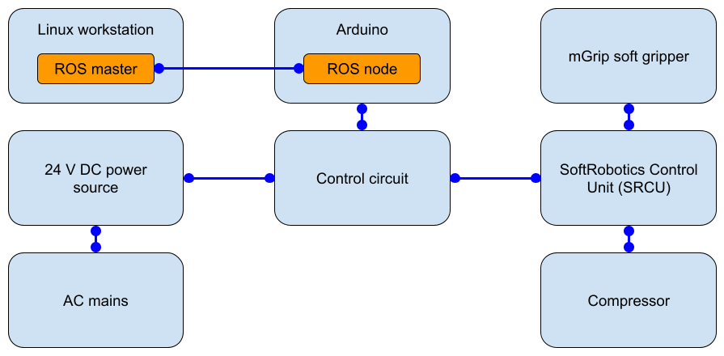

This directory contains information about the control circuit for the [Soft Robotics mGrip](https://www.softroboticsinc.com/products/mgrip-modular-gripping-solution-for-food-automation/) gripper, and Arduino Uno code for controlling it. The code allows for
- opening and closing the gripper,
- adjusting the gripper opening amount (also called stroke), and
- adjusting the grip strength.

## Overall block diagram


## Control Circuit


## Notes
- The port connections in the control circuit diagram above are ports on the SoftRobotics Inc. control unit. It was tested with the [SRCU-Mini-P Mounted](https://www.softroboticsinc.com/uploads/2020/01/TS-200175-rev.-A-SRCU-Mini-P-Mounted-Ass.-Tech-Sheet.pdf), but should also work with the [SRCU-Mini](https://www.softroboticsinc.com/uploads/2020/01/Tech-Sheet-SRCU-Mini-pn-200163-rev.-D.pdf).
- The [California Air Tools 4610AC](https://www.californiaairtools.com/ultra-quiet-series-of-air-compressor-contractor-grade/1-0-hp-air-compressors/cat-4610ac/) compressor works well with this setup.

## Steps
1. Set up `rosserial_arduino`: [tutorial](http://wiki.ros.org/rosserial_arduino/Tutorials/Arduino%20IDE%20Setup).
2. Through the Arduino IDE, compile and burn [`interactive.ino`](interactive.ino) on the Arduino Uno.
3. Set up the `softgrasp_ros` ROS package on the workstation from the [`ros_drivers_utils`](../ros_drivers_utils) directory.
4. Connect the Arduino Uno to the workstation with a USB cable. Note its serial port (likely `/dev/ttyACM0`) and then

```bash
$ roslaunch softgrasp_ros hand_control_interface.launch serial_port:=/dev/ttyACM0
```

in another terminal, grasp close: `rosservice call /grasp_state true`, grasp open: `rosservice call /grasp_state false`. More details in [`README.md`](../ros_drivers_utils/README.md).
