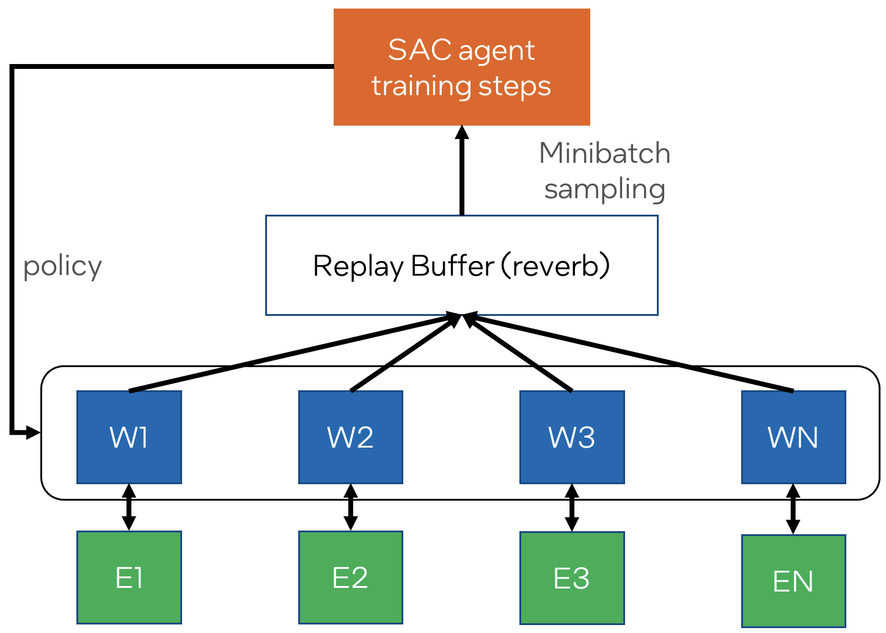

# Distributed SAC Utilities

Utilities for training reinforcement learning policies with the [Soft Actor-Critic](https://arxiv.org/abs/1812.05905)
(SAC) algorithm. It uses [TensorFlow Agents](https://www.tensorflow.org/agents), and includes the following features:
- Following [this TF-Agents distributed training example](https://github.com/tensorflow/agents/tree/master/tf_agents/experimental/distributed/examples/sac),
the framework is cleanly divided into completely separate programs:
  - Experience collection workers (each with their own environment)
  - Replay buffer implemented with [deepmind/reverb](https://www.deepmind.com/open-source/reverb)
  - SAC policy trainer
- Can seed the replay buffer with experience collected with a random policy, to encourage exploration
- Finegrained control over the number of CPUs allocated to each program
- Checkpointing and tensorboard logging
- "[Supervision](https://en.wikipedia.org/wiki/Process_supervision)" of the training using
[daemontools/supervise](https://cr.yp.to/daemontools/supervise.html) automatically resumes the training from the last
checkpoint if some program crashes, which is useful when running on a compute cluster
- [SLURM](https://slurm.schedmd.com) compute cluster support
- Configure the environment hyperparameters and their curriculum with JSON

## [Documentation Link](docs/documentation.md)
- [Installation](docs/documentation.md#installation)
- [Usage](docs/documentation.md#usage)
  - [Training - Code](docs/documentation.md#training---code)
  - [Training - Configuration](docs/documentation.md#training---configuration)
  - [Training - Execution](docs/documentation.md#training---execution)
  - [Policy Evaluation](docs/documentation.md#policy-evaluation)
- [Environment Parameters Curriculum](docs/documentation.md#environment-parameters-curriculum)
- [SLURM Support](docs/documentation.md#slurm-support)

## [Reproduce ContactInsert](docs/README.md)
- [Installation](docs/README.md#installation)
- [Training](docs/README.md#training)
- [Policy Evaluation](docs/README.md#policy-evaluation)
