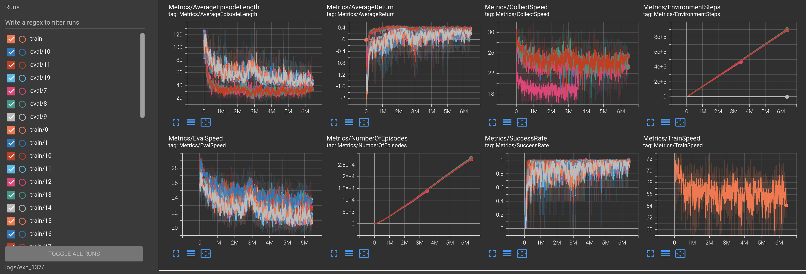

# Reproduce ContactInsert

## Installation
We use MuJoCo 2.0.0 for physics simulation. After following the general [SAC Utilities installation steps](documentation.md#installation), do the following:

### Common to both Linux and MacOS
- Download [MuJoCo 2.0.0](https://roboti.us/download.html) in `~/.mujoco`. Make sure the dicrectory structure is `~/.mujoco/mujoco200_linux/{bin,doc,include,model,sample}`.
- `cp mjkey.txt ~`

### Extra steps for MacOS
- `brew install gcc`
- `export CC=/usr/local/bin/gcc-11` (check the GCC version actually installed by Homebrew and modify accordingly)
- Go to System Preferences -> Security and Privacy -> Developer Tools. Give your terminal app permission to run
software locally does not meet the system's security policy.
- Navigate to the `mujoco200_linux` directory, right click all `.dylib` files and click Open -> Allow.

### Continued: Common to both Linux and MacOS
- `cd install_contact_insert && ./install.sh ../../robosuite`
- `conda activate sac_utils`

## Training


```bash
(base) $ conda activate sac_utils
(sac_utils) $ ./run_script.sh training_variables_contact_insert.sh
```

## Policy Evaluation

Download the checkpoint from links below, and unzip it at `CKPT_DIR`.

| Model | Link | `CKPT_NAME` | Experiment ID |
|-------|------| ------| ------|
| ours  | [Google Drive](https://drive.google.com/file/d/1818m4RA8mB2mHl1L3bPkBLe2FpmXyTBd/view?usp=sharing) | `policy_checkpoint_0005200000` | `exp_137` |

```bash
(sac_utils) $ python tfagents_system/run.py --params tfagents_system/contact_insert_params.py --exp_dir $CKPT_DIR \
--config config/contact_insert.json --num_episodes 5 --checkpoint $CKPT_NAME
```
